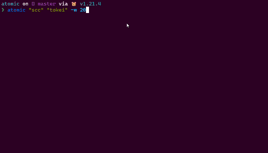

# atomic

[](https://github.com/shravanasati/atomic/actions/workflows/integrate.yml)




*atomic* is a simple CLI tool for making benchmarking easy.


<br>

## ✨ Features

- Detailed benchmark summary at the end
- Export the results in markdown, json, csv format
- Statistical Outlier Detection
- Plot the benchmarking data, comparing the different commands
- Arbitrary command support 
- Constant feedback about the benchmark progress and current estimates.
- Warmup runs can be executed before the actual benchmark.
- Cache-clearing commands can be set up before each timing run.

<br>

## ⚡️ Installation


### Installation Scripts

#### Linux and macOS

```bash
curl https://raw.githubusercontent.com/shravanasati/atomic/master/scripts/install.sh | bash
```

### Package Managers

#### Windows
```powershell
scoop install https://github.com/shravanasati/atomic/raw/master/scripts/atomic.json
```

### GitHub Releases

atomic binaries for all operating systems are available on the [GitHub Releases](https://github.com/shravanasati/atomic/releases/latest) tab. You can download them manually and place them on `PATH` in order to use them.

To simplify this process, you can use [eget](https://github.com/zyedidia/eget):
```
eget shravanasati/atomic
```

### Using Go compiler

If you've Go compiler (v1.21 or above) installed on your system, you can install atomic via the following command. 

```
go install github.com/shravanasati/atomic@latest
```


### Build from source

You can alternatively build atomic from source via the following commands (again, requires go1.21 or above):

```
git clone https://github.com/shravanasati/atomic.git
cd ./atomic
go build
```

If you want to build atomic in release mode (stripped binaries, compressed distribution and cross compilation), execute the following command. You can also control the release builds behavior using the [`release.config.json`](./scripts/release.config.json) file.

```
python ./scripts/build.py
```

<br>

To verify the installation of *atomic*, open a new shell and execute `atomic -v`. You should see output like this:
```
atomic 0.4.0

Version: 0.4.0
```
If the output isn't something like this, you need to repeat the above steps carefully.


<br>

## 💡 Usage

```
atomic v0.4.0


atomic is a simple CLI tool to benchmark commands. 
For more info visit https://github.com/shravanasati/atomic.

Usage:
   atomic [commands] {flags}
   atomic <command> {flags}

Commands: 
   help                          displays usage information
   version                       displays version number

Arguments: 
   commands                      The command to run for benchmarking. {variadic}

Flags: 
   -c, --cleanup                 The command to execute once after every run. (default: ~!_default_!~)
   --no-color                    Disable colored output. (default: false)
   -e, --export                  Comma separated list of benchmark export formats, including json, text, csv and markdown. (default: none)
   -f, --filename                The filename to use in exports. (default: atomic-summary)
   -h, --help                    displays usage information of the application or a command (default: false)
   -I, --ignore-error            Ignore if the process returns a non-zero return code (default: false)
   -M, --max                     Maximum number of runs to perform. (default: 9223372036854775807)
   -m, --min                     Minimum number of runs to perform. (default: 10)
   --outlier-threshold           Minimum number of runs to be outliers for the outlier warning to be displayed, in percentage. (default: 0)
   -p, --plot                    Comma separated list of plot types. Use all if you want to draw all the plots, or you can specify hist/histogram, box/boxplot, errorbar, bar, bubble. (default: none)
   -p, --prepare                 The command to execute once before every run. (default: ~!_default_!~)
   -r, --runs                    The number of runs to perform (default: -1)
   -s, --shell                   Whether to use shell to execute the given command. (default: false)
   --shell-path                  Path to the shell to use. (default: cmd.exe)
   -u, --time-unit               The time unit to use for exported results. Must be one of ns, us, ms, s, m, h. (default: ms)
   -t, --timeout                 The timeout for a single command. (default: 2540400h10m10.000000000s)
   -V, --verbose                 Enable verbose output. (default: false)
   -v, --version                 displays version number (default: false)
   -w, --warmup                  The number of warmup runs to perform. (default: 0)

```


<br

## Acknowledgement

This tool is heavily inspired by [*hyperfine*](https://github.com/sharkdp/hyperfine). I learnt a lot of stuff looking at the code of this project and tried matching the feature-set as close as possible.

## Known Issues and Missing Features

- [ ] Shell calibration yields negative process run times
- [ ] No Color functionality is broken
- [ ] Implementation of errorbar, boxplot and bubble chart is pending
- [ ] Plot command is missing

## 🔖 Versioning
*atomic* releases follow semantic versioning, every release is in the *x.y.z* form, where:
- *x* is the MAJOR version and is incremented when a backwards incompatible change to atomic is made.
- *y* is the MINOR version and is incremented when a backwards compatible change to atomic is made, like changing dependencies or adding a new function, method, struct field, or type.
- *z* is the PATCH version and is incremented after making minor changes that don't affect atomic's public API or dependencies, like fixing a bug.

<br>

## 📄 License
License
© 2021-Present Shravan Asati

This repository is licensed under the MIT license. See [LICENSE](LICENSE) for details.

<br>
