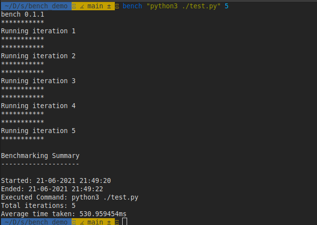

# bench

[](https://github.com/Shravan-1908/bench/actions/workflows/integrate.yml)




*bench* is a simple CLI tool for making benchmarking easy.


<br>

## ✨ Features

- Benchmarks programs easily with just one command, no extra code needed
- Export the results in markdown, json and text formats
- Universal support, you can benchmark any shell command 
- Choose the number of iterations to perform
- Detailed benchmark summary at the end
- Fast and reliable

<br>

## ⚡️ Installation

**For Linux users:**

Execute the following command in bash:

```bash
curl https://raw.githubusercontent.com/Shravan-1908/bench/master/scripts/linux_install.sh > bench_install.sh

chmod +x ./bench_install.sh

bash ./bench_install.sh
```


**For MacOS users:**

Execute the following command in bash:

```bash
curl https://raw.githubusercontent.com/Shravan-1908/bench/master/scripts/macos_install.sh > bench_install.sh

chmod +x ./bench_install.sh

bash ./bench_install.sh
```

**For Windows users:**

Open Powershell **as Admin** and execute the following command:
```powershell
Set-ExecutionPolicy Bypass -Scope Process -Force; (Invoke-WebRequest -Uri https://raw.githubusercontent.com/Shravan-1908/bench/master/scripts/windows_install.ps1 -UseBasicParsing).Content | powershell -
```

To verify the installation of *bench*, open a new shell and execute `bench -v`. You should see output like this:
```
bench 0.1.1

Version: 0.1.1
```
If the output isn't something like this, you need to repeat the above steps carefully.


<br>

## 💡 Usage
This section shows how you can use *bench*.


You can benchmark anything with bench, python programs, executables, shell commands or anything. To benchmark with bench, simply execute:

```
bench <command> [iterations]
```

The `command` argument is the command to execute for benchmarking, like `python3 file` or `./executable`.

The `iterations` argument defaults to 10, if not provided.

Example:
```
bench "node speedtest.js" 20
```

You can export the benchmark summary in three different formats - markdown, text and json.

To export the results, use the `--export` flag. A file named `bench-summary.format` will be created.

Example:
```
bench "node speedtest.js" 20 --export json
```

### up

`$ bench up`

The `up` command can be used to update *bench* to the latest version right away, without any need to execute those shell commands again. 


### version
`$ bench version`
>
The version command shows the version of *bench* installed.

### help
`$ bench help`

Renders assistance for *bench* on a terminal, briefly showing its usage.

<br


## 🔖 Versioning
*bench* releases follow semantic versioning, every release is in the *x.y.z* form, where:
- *x* is the MAJOR version and is incremented when a backwards incompatible change to bench is made.
- *y* is the MINOR version and is incremented when a backwards compatible change to bench is made, like changing dependencies or adding a new function, method, struct field, or type.
- *z* is the PATCH version and is incremented after making minor changes that don't affect bench's public API or dependencies, like fixing a bug.

<br>

## 📄 License
License
© 2021-Present Shravan Asati

This repository is licensed under the MIT license. See [LICENSE](LICENSE) for details.

<br>
